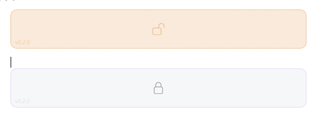
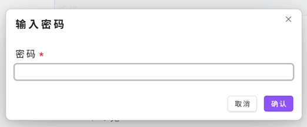
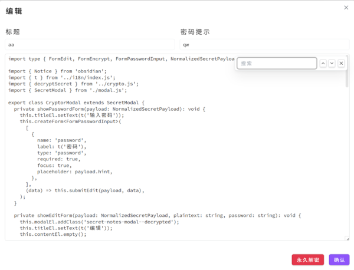

# Obsidian Secret Notes

[中文文档](README.zh.md)

Save private content in Obsidian with a `secret` code block. The plugin renders the block as a clickable secret card; after encryption, only ciphertext JSON is stored in your note, and plaintext is shown temporarily only after the correct password is entered.

- 🔒 Local encryption: your password never leaves your device and is never stored.
- 🧩 Minimal card UI: plaintext blocks show an unlock icon, encrypted blocks show a lock icon, and clicking the card starts the next action.
- ✍️ After decrypting, you can edit the title, password hint, and body, then re-encrypt the block in place.
- 🔎 Built-in editor search: click the search icon in the plaintext editor, or select text and press `Ctrl+F` to search quickly.
- ⚙️ The processed code block name is configurable in plugin settings. The default is `secret`.

## Quick start

Create a `secret` code block in any note:

<pre>
```secret
Put private content here
```
</pre>

<pre>
```secret
{"v":1,"title":"","hint":"","encrypted":"<iv>:<tag>:<ciphertext>","date":"2026-07-04T00:00:00.000Z"}
```
</pre>
These two blocks will be rendered like:




Click the locked card again and enter the password to view or edit the plaintext.
- The unlock icon means the block is still plaintext. Click it to start encryption.
- The lock icon means the block is encrypted. Click it to enter the password and view/edit the content.

### Password input




After clicking an encrypted card, a password modal opens:

- Enter the correct password to open the plaintext editor.
- If a password hint was saved during encryption, it appears in the password input placeholder.
- Plaintext is never shown when the password is incorrect.

### Plaintext editor



After verification, the plaintext editor opens:

- Use the search bar in the upper-right corner to search the body; previous/next navigation is supported, and jumped matches flash for easier positioning.
- Click **Decrypt permanently** and confirm the second-click prompt to write plaintext back into the `secret` code block. You can encrypt it again later by clicking the plaintext card.


## Operations

| Action              | Entry point                                                                      | Result                                                                                     |
| ------------------- | -------------------------------------------------------------------------------- | ------------------------------------------------------------------------------------------ |
| Encrypt             | Click a plaintext card                                                           | Enter password and confirmation password, then encrypt and write back to the current block |
| View / Edit         | Click an encrypted card                                                          | Enter password to open the plaintext editor, where title, hint, and body can be changed    |
| Save again          | **Confirm** in the plaintext editor                                              | Re-encrypt with the current password and overwrite the original block                      |
| Decrypt permanently | **Decrypt permanently** in the plaintext editor                                  | After second-click confirmation, write plaintext back into the `secret` code block         |
| Search body         | Search in the upper-right of the plaintext editor, or press `Ctrl+F` in the body | Find, navigate, and flash-highlight matches inside the text area                           |

> Write-back behavior: in source / Live Preview editing state, the current editor block is replaced directly; in Reading view, the file is modified through the Obsidian vault API.

## Settings

Open **Settings → Community plugins → Secret Notes** to change **Block name**.

The default block name is `secret`. If you change it to `private`, for example, the plugin will process:

<pre>
```private
Private content
```
</pre>

## Encryption details

- Algorithm: **AES-256-GCM**, executed locally through the Web Crypto API.
- Key: derived from the password with SHA-256. It is not stored or uploaded.
- Storage format: encrypted block content is JSON containing version, title, password hint, ciphertext, and encryption date.

> ⚠️ Passwords cannot be recovered. If you forget the password, the ciphertext cannot be restored. The password hint should be only a reminder; do not put the actual password in it.

## Installation

### Manual install

1. Download `main.js`, `manifest.json`, and `styles.css` from this repository's build output or Release.
2. Place them into your Obsidian vault:
   ```
   <vault>/.obsidian/plugins/obsidian-secret-notes/
   ```
3. In Obsidian, open **Settings → Community plugins** and enable **Secret Notes**.

## Development

The entry point is `src/main.ts`, and build artifacts are written to `dist/`.

```bash
pnpm install
pnpm build      # build into dist/
pnpm dev        # watch mode
```

Build output includes:

- `dist/main.js`
- `dist/manifest.json`
- `dist/styles.css`

Copy these three files into `.obsidian/plugins/obsidian-secret-notes/` in your vault to load and debug the plugin in Obsidian.

## License

[MIT](LICENSE) © 2026 Kasukabe Tsumugi
